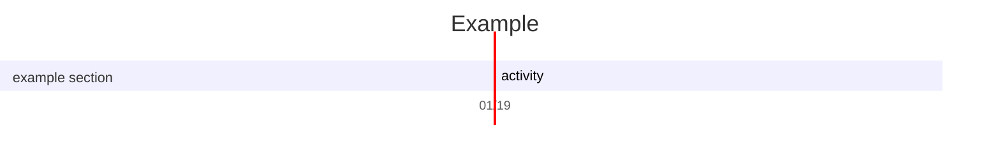

- Colorscheme: `catppuccin-frappe`
- markdown renderer: `render-markdown.nvim`
- markdown preview: `preview-markdown.nvim`

# shdka j  
## sd a
### asd asd
#### asdasd
##### sajdhas
###### ajs hda

--- 
***

con l'implementazione di cmp ha completamento automatico sia delle liste, dei callouts, e dei blocchi di codice

## Liste:

- ad sahd
    - sjd a
        - askdlj 
            - ajshd 

- [ ] Task to do
    - [-] Task work in progress
    - [x] Task done
- [~] Custom one


> dasjhd sjkshd  sakjhd kjashdksja dhshhhhhhhhhhhhhhhhhhhhhhhhhhhhhhhhhhhhhhhhhhhhhhhhhhhhhhhhhhhhhhhhhhhhhhhhhhhhhhhhhhhhhhhhhhhhhhhhhjhhhhhhhhhhkaj shdkj askjdh ksjahd asdsadsad

#### Codes

`Inline code`

```python 
print("Hello !")
```

```python
def main() -> None:
    print("Hello, World!")
```

```rust
fn main() {
    println!("Hello, World!");
}
```

```bash
ls -ad ./
sudo mount /dev/sda /mnt/myusb
```


### Callouts
    
This should be displayed even in  markdown exporters

Importante: dopo il [!..] non lasciare spazi vuoti

> [!NOTE]
> prova nota with >

> [!TIP]
> prova nota with >

> [!IMPORTANT]
> sd as

> [!WARNING]
> sadsd

> [!CAUTION]
> sd sa

> [!ABSTRACT]
> skdj as

> [!SUMMARY]
> asdh as

> [!TLDR]
> sad s 

> [!INFO]
> sdj hsa

> [!TODO]
> sa djhas 

> [!HINT]
> sada sd

> [!SUCCESS]
> sjadhas

> [!CHECK]
> jkh sad 

> [!DONE]
> kj sdas 

> [!QUESTION]
> hasdk j 

> [!HELP]
> jshd s ad

> [!FAQ]
> jh sadh 

> [!ATTENTION]
> sh sad

> [!FAILURE]
>  jshdj h

> [!FAIL]
> jkash dasjh 

> [!MISSING]
> jh asjhd  

> [!DANGER]
> hg ksaas 

> [!ERROR]
> jhsa kd

> [!BUG]
> jkh as d

> [!EXAMPLE]
> jh asd 

> [!QUOTE]
> sadjsa d

> [!CITE]
> jh sakdjh 

#### Links

- 
- [Markdown File](test.md)
- [Python File](test.py)
- [Website](https://test.com)
- [[wikilink]]
- [[wikilink|Wikilink Alias]]
- [Reference][example]
- <user@test.com>


## Tabelle


| test! | prova           |
|-------|-----------------|
| ciao  | coamskdj alkjsd |


##### Markdown preview 


`:MarkdownPreviewStart`
@startuml
Bob -> Alice : hello
@enduml

.

``` plantuml
Bob -> Alice : hello
```




``` latex
$$ a^3 \sqrt{as} $$
```

> provasdjh asjdh d jas
s dksaj ldajsd s
a dskd j
> sdhs 


